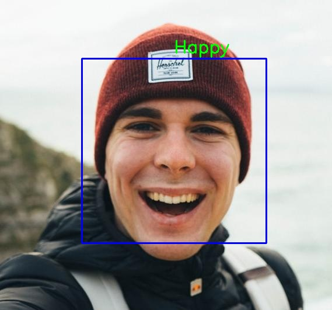
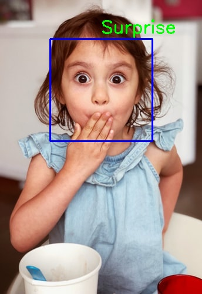

# 🎭 Nhận Diện Cảm Xúc Trên Khuôn Mặt
### *Facial Recognition and Emotion Detection*

----------
 
----------

## 🌟 Tổng Quan

Con người giao tiếp không chỉ bằng lời nói mà còn thông qua ngôn ngữ cơ thể và biểu cảm khuôn mặt. Những cảm xúc được thể hiện qua khuôn mặt làm tăng độ rõ ràng của các ý tưởng và suy nghĩ. Việc máy tính có thể nắm bắt được đặc điểm phức tạp này của con người - cảm xúc - là một điều vô cùng thú vị.

Dự án này xây dựng một mô hình có khả năng phát hiện cảm xúc từ hình ảnh khuôn mặt, góp phần tạo ra những ứng dụng thông minh hơn trong tương lai.

## 🔧 Quy Trình Phát Triển

### 1. 📊 Thu Thập và Xử Lý Dữ Liệu
- **Dataset**: Sử dụng bộ dữ liệu **fer2013** được tải từ [GitHub Repository](https://github.com/npinto/fer2013)
- **Augmentation**: Thực hiện tăng cường dữ liệu để cải thiện khả năng tổng quát hóa của mô hình

### 2. 🏗️ Xây Dựng Mô Hình
Kiến trúc mô hình bao gồm các thành phần chính:
- **CNN Layers**: Các lớp tích chập để trích xuất đặc trưng
- **Max Pooling**: Giảm kích thước và tăng tính bất biến
- **Flatten**: Chuyển đổi dữ liệu 2D thành 1D
- **Dropout**: Ngăn chặn overfitting

### 3. 🎯 Huấn Luyện Mô Hình
- Thử nghiệm với nhiều biến thể của các lớp được đề cập
- Tối ưu hóa siêu tham số (hyperparameters)
- **Kết quả**: Mô hình tốt nhất đạt **60.1% độ chính xác** trên tập validation

### 4. 🧪 Kiểm Thử
Mô hình được kiểm tra với các hình ảnh mẫu:

<p align="center">
   
   
   
</p>

## 😊 Các Loại Cảm Xúc Được Nhận Diện

Mô hình có khả năng phát hiện **7 loại cảm xúc** cơ bản:

| Cảm Xúc | Tiếng Anh | Mô Tả |
|---------|-----------|--------|
| 😠 | Angry | Tức giận |
| 😢 | Sad | Buồn bã |
| 😐 | Neutral | Trung tính |
| 🤢 | Disgust | Ghê tởm |
| 😲 | Surprise | Ngạc nhiên |
| 😨 | Fear | Sợ hãi |
| 😊 | Happy | Vui vẻ |

## 🚀 Hướng Dẫn Sử Dụng

### 📝 Nhận Diện Cảm Xúc Từ Hình Ảnh
```bash
# Tham khảo notebook
/Emotion_Detection.ipynb
```
*Mô hình đã được huấn luyện và lưu trữ tại thư mục `/Models`*

### 🔧 Huấn Luyện Mô Hình Riêng
```bash
# Tham khảo notebook để tự huấn luyện
/facial_emotion_recognition.ipynb
```

### 🎥 Nhận Diện Cảm Xúc Qua Webcam
```bash
# Clone repository
git clone [repository-url]

# Cài đặt dependencies
pip install -r requirements.txt

# Chạy ứng dụng
python Emotion_Detection.py
```

## 📂 Cấu Trúc Thư Mục
```
├── Models/                 # Mô hình đã huấn luyện
├── Test_Images/           # Hình ảnh kiểm thử
├── Emotion_Detection.ipynb # Notebook chính
├── facial_emotion_recognition.ipynb # Notebook huấn luyện
├── Emotion_Detection.py   # Ứng dụng webcam
└── requirements.txt       # Dependencies
```

## 🎯 Ứng Dụng Thực Tế
- **Giáo dục**: Đánh giá mức độ tập trung của học sinh
- **Y tế**: Hỗ trợ chẩn đoán tâm lý
- **Giải trí**: Tương tác thông minh trong game
- **Kinh doanh**: Phân tích phản hồi khách hàng

---

*Dự án này mở ra những khả năng vô hạn trong việc tạo ra các ứng dụng có thể hiểu và phản hồi với cảm xúc con người.*